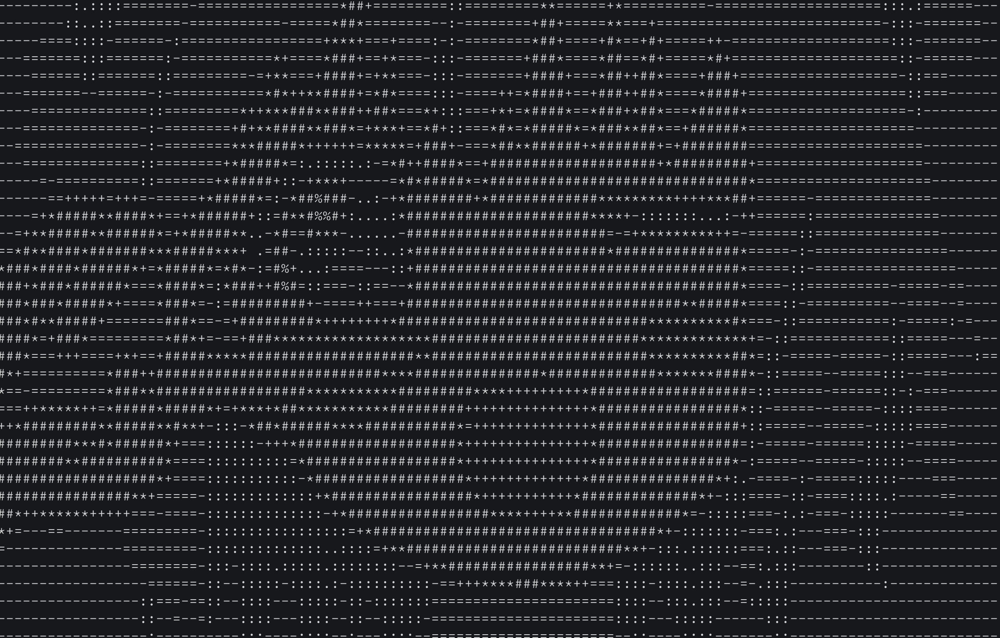
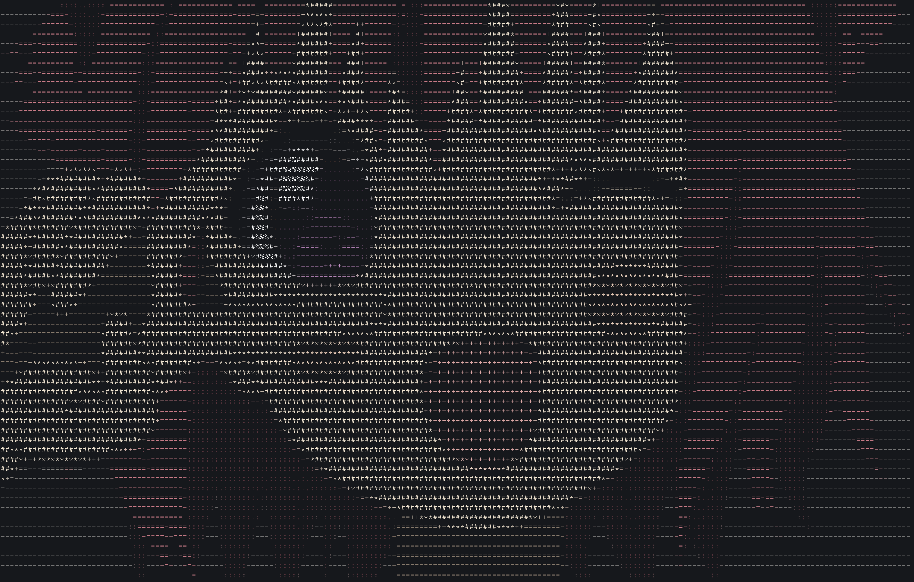

# RUA

A simple CLI tool to convert images into ascii art and print them on the console.

## Usage 

```bash
rua ./image.png 
```



You can add `--width` to specify the output width and `--color` to output with color.




